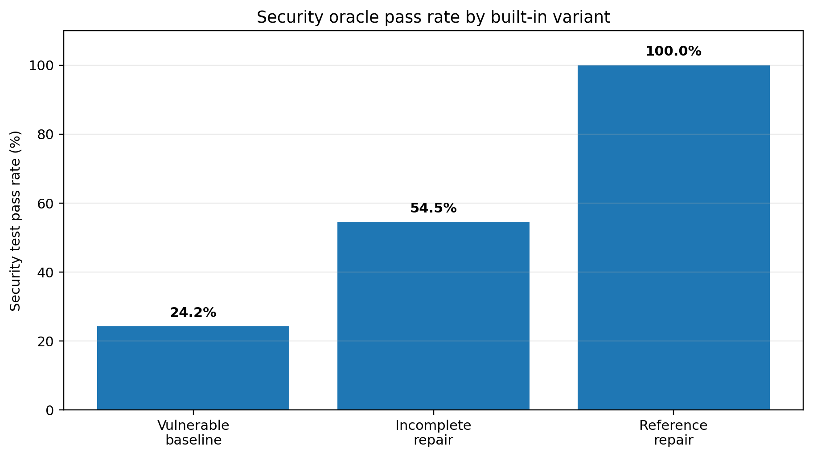
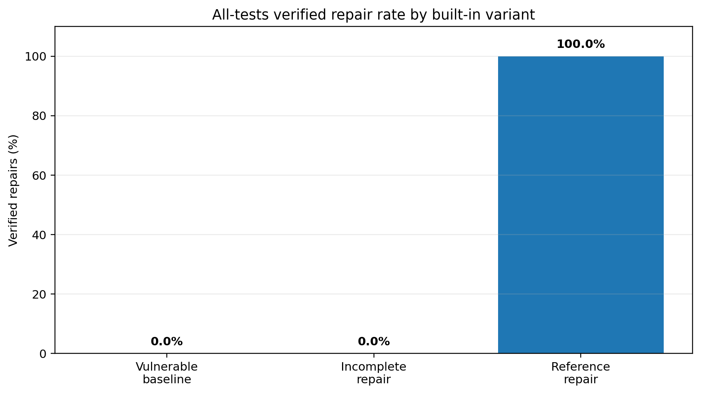
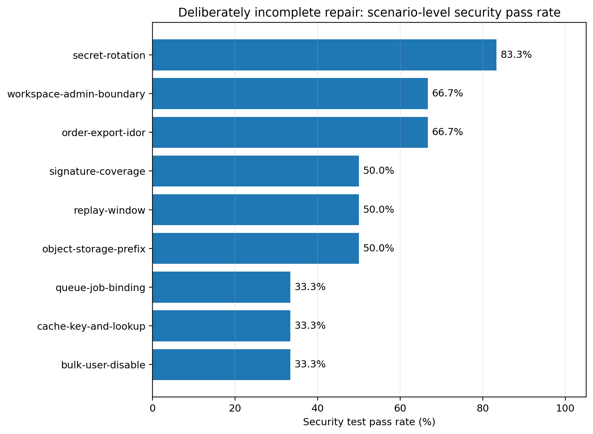

# SecurePatch Bench v0.1

## Paired Functional and Security Oracles for Complete SaaS Vulnerability Remediation

**Abdul Badran**  
Pcnaid Inc., Mansfield, Texas, United States  
Correspondence: badran.abdul@pcnaid.com  
ORCID: not assigned  
Version 0.1.0 - September 2026

> **Publication status:** Technical Report / Preprint - Not Peer Reviewed
>
> **Result boundary:** This report validates the benchmark's test oracles against intentionally vulnerable, deliberately incomplete, and reference implementations. It does not report the performance of any language model or coding agent.

## Abstract

AI coding agents can produce patches that compile and preserve ordinary application behavior while leaving the underlying security invariant incomplete. This risk is acute in software-as-a-service (SaaS) systems, where authorization, tenant isolation, asynchronous jobs, object storage, and webhook processing often span multiple trust boundaries. Existing software-engineering and cybersecurity benchmarks have established the importance of executable evaluation, real-world issue resolution, exploit reproduction, and regression testing. However, compact and reproducible studies are still needed to isolate a practical question faced by small software teams: when a candidate repair appears plausible, can an evaluator distinguish a complete remediation from a partial fix that leaves one material path open?

This report introduces SecurePatch Bench v0.1, a synthetic TypeScript benchmark built around paired functional and security oracles. The pilot contains nine scenarios across object- and function-level authorization, tenant isolation, and webhook security. Every scenario defines a security invariant, legitimate behavior that must survive repair, security-specific negative controls, and three built-in implementations: a vulnerable baseline, a plausible but deliberately incomplete repair, and a complete reference repair. A candidate is accepted only when all functional and all security tests pass. A weighted score is retained for diagnostics but cannot override this all-tests gate.

The oracle-validation pilot executed 27 evaluations comprising 33 security tests and 11 functional tests per variant in aggregate. All three variants passed all 11 functional tests. The vulnerable baselines passed 8 of 33 security tests (24.2%), incomplete repairs passed 18 of 33 (54.5%), and reference repairs passed 33 of 33 (100%). Nevertheless, zero of nine vulnerable baselines and zero of nine incomplete repairs qualified as verified repairs, while all nine reference repairs qualified. One incomplete webhook key-rotation repair achieved a diagnostic score of 0.90 yet remained correctly rejected because one security condition failed. These results demonstrate that functional preservation and partial security progress are insufficient proxies for complete remediation, and that a strict conjunction of paired oracles can expose residual defects concealed by aggregate scores.

SecurePatch Bench v0.1 is a small design-and-validation study rather than a general model leaderboard. Its intended contribution is an auditable substrate for later controlled evaluations of models, prompts, tools, and agent scaffolds under explicit authorization and reproducibility requirements.

**Keywords:** automated vulnerability repair; secure software development; SaaS security; authorization; tenant isolation; webhooks; AI coding agents; benchmark design; regression testing; security oracles

---

## 1. Introduction

Software repair is not complete merely because a patch builds, a visible test suite turns green, or a model provides a confident explanation. Security defects frequently exist at the boundary between otherwise legitimate features. A SaaS export route may retrieve the correct order but fail to verify ownership. A repository query may be tenant-scoped while its cache key is not. A queue producer may authorize a task while a downstream worker trusts a mutable tenant identifier. A webhook verifier may authenticate selected headers while processing business fields that were never cryptographically bound. In each case, normal functionality can continue to work, and a superficially improved patch can pass many checks, while a residual security path remains.

This distinction matters as language models and coding agents become part of software development and remediation. General software-engineering benchmarks have shown the value of repository-level tasks and executable test harnesses. Security-oriented work has increasingly moved toward reproducible vulnerability environments, proof-of-concept oracles, and functional regression checks. Yet benchmark success remains sensitive to what the evaluator chooses to test. A weak oracle can accept an incomplete patch. A purely exploit-focused oracle can accept a repair that disables legitimate behavior. A weighted average can conceal a single failed security invariant. A benchmark can therefore overstate candidate quality even when its execution environment is deterministic.

SecurePatch Bench v0.1 addresses a narrow question: **Can a compact paired-oracle design reliably reject plausible but incomplete repairs of recurring SaaS trust-boundary defects while accepting complete reference repairs and preserving legitimate behavior?**

The benchmark focuses on nine synthetic TypeScript scenarios drawn from three families:

1. authorization and administrative scope;
2. tenant isolation across repositories, caches, asynchronous jobs, and object storage; and
3. webhook authenticity, message coverage, freshness, replay resistance, and key lifecycle.

The scenarios are not copies of customer systems and are not designed to instruct attacks against live targets. They are small local programs whose interfaces, fixtures, and failure modes are intentionally controlled. Each scenario contains three implementations for validating the evaluator:

- a **vulnerable baseline** that preserves expected user-facing behavior but violates the stated invariant;
- a **naive repair** that closes one obvious path while intentionally omitting at least one material condition; and
- a **reference repair** intended to satisfy both functional and security oracles.

This design treats the naive repair as a first-class negative control. The purpose is not to show that insecure code fails obvious tests. The purpose is to determine whether the evaluator can distinguish a credible-looking partial fix from a complete repair.

### 1.1 Contributions

This report makes four bounded contributions:

1. **A paired-oracle benchmark design for SaaS trust boundaries.** Every scenario requires both functional preservation and complete satisfaction of an explicit security invariant.
2. **Deliberately incomplete repairs as negative controls.** Each scenario includes a plausible naive repair that improves security-test performance without qualifying as complete.
3. **An all-tests verification rule separated from diagnostic scoring.** A weighted score communicates partial progress, while verified repair requires zero failures in both suites.
4. **An executable TypeScript pilot and reproducible result format.** The open-source package includes manifests, scenario harnesses, a command-line runner, generated JSON results, and a human-readable report.

The project is intentionally small. It does not claim broad vulnerability coverage, real-world prevalence, or model-performance conclusions. It provides a validated base for a later model study.

---

## 2. Background and Related Work

### 2.1 Secure software development and AI-assisted development

NIST's Secure Software Development Framework (SSDF) recommends integrating secure development practices into each software development lifecycle so producers can reduce released vulnerabilities, limit the impact of undetected defects, and address root causes [1]. NIST SP 800-218A extends that framework with AI-specific practices for producers and acquirers of generative AI and dual-use foundation-model systems [2]. These frameworks do not prescribe a single benchmark, but they support the central premise of this work: secure development requires repeatable practices and evidence throughout the lifecycle, rather than a one-time code-generation event.

The SecurePatch design aligns most directly with three recurring secure-development needs:

- define the security requirement or invariant before accepting a patch;
- verify the repair with executable evidence; and
- preserve expected behavior so remediation does not simply move risk into availability or compatibility failures.

### 2.2 Repository-level software repair

SWE-bench introduced a large repository-level evaluation in which models receive real GitHub issues and codebases and must produce patches that satisfy executable tests [3]. Its tasks demonstrate that software repair often requires coordinated reasoning across files, functions, and long contexts. SecurePatch Bench adopts the general principle that candidate quality should be determined by execution rather than prose alone, but it differs in scope. SecurePatch uses compact synthetic TypeScript scenarios, focuses on explicit security invariants, and includes a deliberately incomplete repair for oracle validation.

### 2.3 Cybersecurity capability and vulnerability benchmarks

CyberSecEval 2 provides a broad suite for measuring security risks and capabilities of large language models, including prompt injection, code-interpreter abuse, false refusal, and vulnerability-related tasks [4]. CVE-Bench constructs reproducible environments for evaluating whether agents can exploit real-world web vulnerabilities [5]. SEC-bench evaluates proof-of-concept generation and vulnerability patching on authentic security engineering tasks with automated sandbox construction and gold patches [6]. These efforts demonstrate the importance of controlled execution, explicit task definitions, and reproducible infrastructure.

SecurePatch Bench does not attempt to replace broad capability suites or real-CVE environments. It targets a narrower repair-validation problem in business-logic-heavy SaaS code: identifying whether a candidate enforces the whole trust boundary, including secondary paths such as cache keys, queue payloads, and signature coverage.

### 2.4 Exploit and regression oracles for vulnerability repair

Recent automated vulnerability-repair benchmarks increasingly emphasize stronger validation. VulnRepairEval requires repaired code to defeat functional proof-of-concept exploits in reproducible environments [7]. PATCHEVAL includes runtime environments with both security and functionality tests for a subset of real vulnerabilities across Go, JavaScript, and Python [8]. Vul4Py pairs exploit and functional oracles for every included Python vulnerability and reports that exploit-only acceptance can admit patches that paired validation rejects [9].

SecurePatch Bench is consistent with this direction but makes two distinct design choices. First, its pilot is centered on TypeScript SaaS trust-boundary patterns rather than a multilingual collection of historical CVEs. Second, it explicitly includes a plausible incomplete repair for every scenario, providing a controlled test of whether the oracle catches residual defects rather than only distinguishing the original vulnerable revision from the developer's fix.

### 2.5 Authorization and webhook standards

The authorization scenarios draw on recurring weaknesses described by OWASP's Broken Object Level Authorization category and MITRE CWE-639, in which user-controlled keys or identifiers can bypass intended access boundaries [10, 11]. The webhook scenarios apply established message-authentication principles. RFC 2104 specifies HMAC as a keyed message-authentication mechanism [12]. RFC 9421 emphasizes that message components not covered by a signature remain susceptible to modification and describes HTTP message signature construction and verification [13]. The benchmark uses compact synthetic HMAC flows rather than claiming full RFC 9421 conformance, but the signature-coverage scenarios reflect the same underlying requirement: every component that influences trusted processing must be cryptographically bound or otherwise validated.

---

## 3. Research Questions

The v0.1 pilot addresses four research questions about benchmark validity rather than model capability.

**RQ1: Negative-control rejection.** Does the paired-oracle harness reject every intentionally vulnerable baseline and every deliberately incomplete repair?

**RQ2: Reference acceptance.** Does the harness accept every complete reference repair while preserving legitimate behavior?

**RQ3: Functional-test insufficiency.** Can candidates pass all functional tests while remaining insecure according to the scenario's security invariant?

**RQ4: Aggregate-score masking.** Can a high weighted diagnostic score coexist with a failed security invariant, demonstrating the need for an all-tests verification gate?

No hypothesis test is applied to these questions. The variants are intentionally constructed validation cases, not a random sample from a defined population. The relevant evidence is exact acceptance and rejection behavior under the published harness.

---

## 4. Benchmark Design

### 4.1 Scope and design principles

SecurePatch Bench v0.1 was designed around six principles.

1. **Explicit invariant.** Every scenario states the security property that a valid repair must enforce.
2. **Legitimate behavior.** Every scenario names behavior that must continue to work.
3. **Paired oracles.** Functional and security tests are reported separately.
4. **Plausible incomplete repair.** The naive variant closes an obvious gap but leaves a material residual defect.
5. **Strict acceptance.** Any failed test prevents verified-repair status.
6. **Synthetic and defensive provenance.** No real credentials, personal data, customer code, or live targets are required.

### 4.2 Scenario anatomy

Each scenario consists of a machine-readable `manifest.json` and a TypeScript module. The manifest identifies:

- scenario ID, title, category, and version;
- CWE and OWASP mappings;
- defect summary;
- security invariant;
- visible legitimate behavior;
- security-oracle behaviors;
- descriptions of vulnerable, naive, and reference variants; and
- safe-use and licensing statements.

The TypeScript module exports a harness with `runFunctional` and `runSecurity` methods and factories for the three built-in variants. Test cases return structured names, categories, durations, outcomes, and failure details.

### 4.3 Scenario catalog

Table 1 summarizes the pilot scenarios.

**Table 1. SecurePatch Bench v0.1 scenario catalog**

| ID | Family | Core invariant | Primary mappings |
|---|---|---|---|
| `authorization/order-export-idor` | Authorization | Export requires same-tenant ownership or same-tenant administrative authority, with uniform public errors | CWE-639, CWE-862; OWASP API1 |
| `authorization/workspace-admin-boundary` | Authorization | Workspace administration requires same-tenant membership and assignment to the target workspace | CWE-285, CWE-862; OWASP API5 |
| `authorization/bulk-user-disable` | Authorization | The complete target set must be authorized before atomic mutation; owner and acting administrator are protected | CWE-285, CWE-862; OWASP API5 |
| `tenant-isolation/cache-key-and-lookup` | Tenant isolation | Repository lookups and cache entries bind resource identity to the authenticated tenant | CWE-639, CWE-668; OWASP API1 |
| `tenant-isolation/queue-job-binding` | Tenant isolation | Producer authorization and worker processing are bound by integrity protection over tenant, resource, and job data | CWE-345, CWE-668, CWE-862 |
| `tenant-isolation/object-storage-prefix` | Tenant isolation | Returned keys remain within a canonical authenticated-tenant prefix after validation and normalization | CWE-22, CWE-639, CWE-668 |
| `webhooks/replay-window` | Webhooks | Acceptance requires a valid signature, a current signed timestamp, and an unused event identifier | CWE-294, CWE-345 |
| `webhooks/signature-coverage` | Webhooks | Every component affecting routing or business processing is cryptographically covered | CWE-345, CWE-347 |
| `webhooks/secret-rotation` | Webhooks | The selected key exists, is active at verification time, and authenticates the exact signed message | CWE-321, CWE-345, CWE-798 |

### 4.4 Variant roles

The built-in variants are not candidate model outputs. They are fixtures for validating benchmark behavior.

#### Vulnerable baseline

The vulnerable implementation supports the ordinary success path but violates the security invariant. Examples include exporting any order by identifier, treating a global administrator flag as universal workspace authority, and accepting any historical webhook key without lifecycle enforcement.

#### Naive repair

The naive implementation represents a plausible partial remediation:

- tenant matching without object ownership;
- same-tenant membership without resource-specific assignment;
- prevalidation of tenant scope without protecting privileged users;
- tenant-aware database lookup with a globally shared cache key;
- authorization at queue creation without worker-side payload integrity;
- textual prefix checking without canonical path boundaries;
- freshness checking without replay state;
- digesting selected business fields while ignoring new routing fields; or
- accepting `current` and `previous` key labels indefinitely.

The naive variant is essential because it prevents the validation exercise from becoming trivial. An evaluator that rejects only the original vulnerable state but accepts the naive repair is not sufficiently complete for the declared scenario.

#### Reference repair

The reference implementation enforces all conditions declared in the manifest and is expected to pass every functional and security test. Reference acceptance is necessary but not by itself sufficient to prove that the oracle is complete; it only demonstrates that the published test contract is satisfiable.

### 4.5 Paired functional and security oracles

The functional suite verifies the positive behavior that should remain available after remediation. The security suite verifies denial, isolation, integrity, freshness, replay, lifecycle, and indistinguishability properties as applicable.

This separation provides two benefits. First, it makes overcorrection visible. A candidate cannot pass by disabling a feature or rejecting all requests. Second, it prevents normal behavior from masking a missing security condition. A candidate may achieve 100% functional success and still fail verification.

### 4.6 Scoring and acceptance

For diagnostics, the harness calculates:

```text
S = 0.40F + 0.60Q
```

where `F` is the functional pass rate and `Q` is the security pass rate. Security receives greater diagnostic weight because the task is remediation, but functional preservation remains mandatory.

Verified repair is defined separately:

```text
verifiedRepair = (functional failures = 0) AND (security failures = 0)
```

The weighted score cannot override the conjunction. This prevents one failed high-impact test from being averaged away.

---

## 5. Implementation and Reproducibility

### 5.1 Software architecture

The v0.1 implementation uses TypeScript and Node.js 22. It contains:

- a manifest catalog and validator;
- dynamic loading of compiled scenario modules;
- functional and security test execution;
- suite summaries and diagnostic scoring;
- built-in and custom-candidate runners;
- a pilot runner that executes all three variants;
- JSON result serialization; and
- Markdown report generation.

The command-line interface supports catalog listing, manifest validation, per-scenario execution, custom-candidate execution, pilot generation, and report rendering.

### 5.2 Reproducible commands

The complete validation sequence is:

```bash
npm ci
npm run ci
```

The `ci` script performs strict TypeScript checking, builds the project, runs Node's test runner, validates every manifest, executes the pilot, and regenerates the JSON and Markdown result artifacts.

### 5.3 Execution environment

The reported pilot was generated on:

- Node.js: v22.16.0
- Platform: Linux
- Architecture: x64
- Benchmark version: 0.1.0
- Scenarios: 9
- Evaluations: 27

The scenario harnesses require no network access, external service, production secret, or third-party target. Clocks and fixtures are controlled within each scenario when freshness or lifecycle conditions are tested.

### 5.4 Result provenance

The runner records scenario identity, category, candidate variant, module path, start time, duration, per-test outcomes, suite totals, diagnostic score, and verified-repair status. Generated pilot results are committed alongside the code so future changes can be checked for unexpected oracle drift.

---

## 6. Oracle-Validation Pilot

### 6.1 Procedure

The pilot loaded all nine manifests and executed the vulnerable, naive, and reference variant for each scenario, yielding 27 evaluations. Every evaluation ran the same scenario-specific functional and security suites.

The primary validation checks were:

- all 18 negative controls, comprising nine vulnerable and nine naive candidates, should be rejected;
- all nine reference candidates should be accepted; and
- functional tests should remain satisfied so negative-control rejection is attributable to security conditions rather than broken basic behavior.

### 6.2 Aggregate results

**Table 2. Aggregate oracle-validation results**

| Variant | Verified repairs | Functional tests | Functional rate | Security tests | Security rate | Mean interpretation |
|---|---:|---:|---:|---:|---:|---|
| Vulnerable baseline | 0/9 | 11/11 | 100.0% | 8/33 | 24.2% | Ordinary behavior preserved; declared security boundary substantially absent |
| Incomplete repair | 0/9 | 11/11 | 100.0% | 18/33 | 54.5% | Material improvement, but at least one residual defect in every scenario |
| Reference repair | 9/9 | 11/11 | 100.0% | 33/33 | 100.0% | All published functional and security conditions satisfied |

The pilot rejected 18 of 18 negative controls and accepted 9 of 9 reference repairs. RQ1 and RQ2 are therefore satisfied for the built-in validation fixtures.



**Figure 1.** The incomplete repairs more than doubled the number of security tests passed relative to the vulnerable baselines, yet none satisfied the complete invariant.



**Figure 2.** The all-tests gate rejected every vulnerable and incomplete candidate and accepted every reference candidate.

### 6.3 Scenario-level incomplete-repair results

**Table 3. Deliberately incomplete repair results**

| Scenario | Functional | Security | Diagnostic score | Verified repair | Residual condition |
|---|---:|---:|---:|:---:|---|
| Bulk user disable | 1/1 | 1/3 | 0.60 | No | Privileged and self-protection conditions remain incomplete |
| Order export IDOR | 2/2 | 2/3 | 0.80 | No | Same-tenant ordinary peer can still access another user's object |
| Workspace admin boundary | 1/1 | 2/3 | 0.80 | No | Same-tenant global administrator lacks target-workspace assignment enforcement |
| Cache key and lookup | 1/1 | 1/3 | 0.60 | No | Database lookup is scoped, but cache identity remains globally shared |
| Object-storage prefix | 1/1 | 2/4 | 0.70 | No | Textual prefix check permits ambiguous or traversal-like values |
| Queue job binding | 1/1 | 1/3 | 0.60 | No | Worker payload can be modified after enqueue authorization |
| Webhook replay window | 1/1 | 2/4 | 0.70 | No | Fresh delivery is checked, but duplicate event processing remains possible |
| Webhook secret rotation | 2/2 | 5/6 | 0.90 | No | Previous-key label remains accepted after its overlap interval |
| Webhook signature coverage | 1/1 | 2/4 | 0.70 | No | Newly added routing fields are not bound to the verified digest |



**Figure 3.** Every incomplete repair passes at least one security test and therefore appears directionally improved, but every one retains a disqualifying failure.

### 6.4 Functional-test insufficiency

Every vulnerable and naive implementation passed all functional tests. Therefore, a functional-only evaluation would have accepted 18 candidates that the paired security oracle rejected. This directly answers RQ3: ordinary test success was insufficient to determine secure remediation in every pilot scenario.

This result should not be interpreted as an estimate of how often real project test suites miss vulnerabilities. The scenarios were intentionally designed so that legitimate positive behavior survives while security conditions differ. The finding is about evaluator structure: functional tests and security tests represent different evidence and cannot be treated as interchangeable.

### 6.5 Aggregate-score masking

The strongest incomplete candidate was the webhook secret-rotation repair. It passed both functional tests and five of six security tests, producing:

```text
S = 0.40(1.00) + 0.60(5/6) = 0.90
```

A threshold such as 0.80 or 0.90 would have accepted this candidate despite continued acceptance of a key outside its intended lifecycle. The strict verification gate rejected it. This answers RQ4 and illustrates why an aggregate score should be diagnostic rather than dispositive when tests encode non-substitutable security requirements.

---

## 7. Findings and Implications

### 7.1 Security improvement is not security completion

The naive variants improved aggregate security-test performance from 24.2% to 54.5%. That is meaningful progress, but it produced no verified repairs. In security-sensitive evaluation, partial improvement and complete remediation are different outcome classes. A model-selection or workflow report should preserve that distinction.

### 7.2 Secondary trust boundaries are easy to omit

Several scenarios demonstrate a recurring structure: one layer is repaired while a secondary layer remains unsafe.

- A repository query is tenant-aware, but the cache key is not.
- A queue producer checks authorization, but the worker trusts mutable payload fields.
- A webhook timestamp is checked, but replay state is absent.
- Selected body fields are digested, but future routing fields are not.
- Key labels are restricted, but actual validity intervals are not enforced.

These are not necessarily difficult cryptographic or algorithmic errors. They are completeness failures across system boundaries. Repository-scale model evaluation should therefore measure whether the candidate identifies every path that participates in the invariant.

### 7.3 All-tests gates express non-substitutable requirements

A score is useful for ranking partial candidates and diagnosing progress. It is not sufficient when one test represents a mandatory condition. Authorization, tenant isolation, and signature validity are not fungible quantities that can always be averaged. SecurePatch's all-tests gate is intentionally conservative: the candidate either satisfies the published contract or it does not.

This principle resembles release gating in safety- and security-sensitive engineering. A team may still use partial scores for triage, but should not label a candidate "verified" when a required invariant fails.

### 7.4 Deliberately incomplete repairs strengthen benchmark self-tests

A benchmark can give a false sense of rigor if it checks only that the original vulnerable version fails and a reference version passes. A naive repair provides a more demanding negative control. It asks whether the test suite can reject an implementation that adopts the obvious recommendation but misses a less visible requirement.

Future benchmark contributions should therefore include at least one incomplete repair derived from a plausible engineering mistake. Multiple naive variants may be warranted for complex scenarios.

### 7.5 Compact synthetic scenarios offer controlled evidence, not prevalence

Synthetic scenarios make it possible to isolate one invariant, control fixtures, avoid disclosure risk, and reproduce results cheaply. Those advantages also limit external validity. The pilot cannot establish how common each defect is, how models perform on large production repositories, or whether success transfers to another language or framework. Its value is experimental control and evaluator validation.

---

## 8. Threats to Validity and Limitations

### 8.1 Construct validity

The security oracles operationalize the invariants selected by the author. A missing test could still allow an invalid patch to pass. Reference acceptance demonstrates satisfiability, not completeness. Future versions should add independent scenario review, mutation testing, and adversarial attempts to bypass each oracle.

The CWE and OWASP mappings are descriptive. A scenario can span multiple weakness categories, and mappings do not imply endorsement or formal classification by MITRE or OWASP.

### 8.2 Internal validity

The built-in variants were written with knowledge of the tests and are therefore unsuitable as model-performance observations. They serve only as benchmark self-tests. The perfect reference-acceptance rate reflects intentional construction, not comparative superiority.

Dynamic module loading and in-process execution could allow a malicious custom candidate to interfere with the evaluator. v0.1 should therefore be run only with trusted or sandboxed candidates. Future releases should isolate candidates in containers or restricted processes.

### 8.3 External validity

The nine scenarios are small, synthetic, TypeScript-only programs. Production systems involve frameworks, middleware, distributed state, deployment configuration, databases, identity providers, caches, and organizational practices not represented here. Results should not be generalized to all SaaS security or automated vulnerability repair.

The pilot is focused on authorization, tenant isolation, and webhooks. It does not cover memory corruption, deserialization, command injection, browser security, cloud control planes, cryptographic primitive design, mobile applications, or malware analysis.

### 8.4 Conclusion validity

The reported percentages are exact summaries of intentionally constructed cases. Confidence intervals and significance tests would imply a sampling interpretation the pilot does not support. A later model study should use repeated independent runs, predeclared exclusions, and uncertainty estimates appropriate to its design.

### 8.5 Publication and contamination

Publishing scenario code and reference repairs makes the v0.1 set unsuitable as a permanently hidden leaderboard. The release is intended as an open research and development set. A future evaluation split should separate public training/development scenarios from evaluator-controlled tests and should document contamination risks.

---

## 9. Proposed Model-Evaluation Protocol

The next phase will evaluate coding models or agents only after the following controls are implemented.

### 9.1 Conditions

At minimum, compare four context conditions:

1. repository and task description only;
2. repository plus a concise threat model;
3. repository plus visible tests and static-analysis evidence; and
4. repository plus an evidence protocol requiring the agent to state the invariant, generate a minimal patch, add or update tests, execute designated checks, and report remaining uncertainty.

### 9.2 Repetitions and metadata

Run at least three independent trials per scenario and condition. Record:

- exact benchmark commit;
- model, provider, and snapshot identifier;
- agent framework and version;
- system and user prompts;
- files and tests visible to the candidate;
- tool permissions and network policy;
- temperature, effort, context, token limits, timeout, and retry policy;
- candidate patch and source hashes;
- functional and security results;
- refusal, invalid-output, and infrastructure-failure categories;
- latency, token usage, and estimated cost; and
- any human intervention.

### 9.3 Candidate isolation

Model-generated code should run in a disposable environment with no production credentials, no customer data, no unrestricted host mounts, and no unnecessary outbound network access. The evaluator should distinguish a candidate failure from an infrastructure failure.

### 9.4 Human review

Automated verification should be supplemented by blinded review of a sample of passing and failing patches. Reviewers should assess patch minimality, maintainability, root-cause alignment, test quality, and whether the candidate exploited a benchmark artifact rather than enforcing the intended invariant.

### 9.5 Claims discipline

Model results should be reported separately from oracle validation. A paper should not say that SecurePatch v0.1 "proves" a model is secure. It can report verified-repair rates on a named release under a fully specified condition.

---

## 10. Ethics, Authorization, and Responsible Release

SecurePatch Bench is intended for lawful defensive research. The scenarios are newly written synthetic programs. They do not contain customer data, production secrets, active service endpoints, or instructions for compromising third-party systems.

The benchmark's safe-use requirements are:

- use only the synthetic scenarios or systems the evaluator owns or is explicitly authorized to assess;
- run untrusted candidate code with least privilege;
- preserve human review before production deployment;
- do not publish accidentally discovered third-party vulnerabilities before coordinated disclosure;
- report exact scope, environment, and limitations; and
- do not convert the harness into mass scanning or offensive automation.

The project uses an Apache-2.0 license for code and CC BY 4.0 for original research prose and dataset documentation. Public release should include the benchmark card, threat model, scoring specification, responsible-use guidance, versioned results, and citation metadata.

---

## 11. Conclusion

SecurePatch Bench v0.1 demonstrates a compact method for validating security-repair evaluators before using them to compare AI coding systems. Across nine synthetic TypeScript SaaS scenarios, all built-in variants preserved ordinary functional behavior. Vulnerable baselines and plausible incomplete repairs nevertheless failed the security oracle in every scenario, while all reference repairs passed. The pilot's most important observation is structural rather than statistical: a candidate can look improved, pass every functional test, and even earn a high weighted score while one material security condition remains unsatisfied.

Paired functional and security oracles, deliberately incomplete repairs, and a strict all-tests gate provide a practical foundation for more credible vulnerability-remediation studies. The next phase is to add candidate isolation, hidden evaluation tests, repeated model trials, cost and latency accounting, and independent review. Until then, v0.1 should be cited as an oracle-validation technical report, not a model leaderboard.

---

## Data and Code Availability

The benchmark code, scenario manifests, generated JSON results, documentation, and technical-report source are prepared in the `PcnaidInc/SecurePatch-Bench` repository and will be released at `https://github.com/PcnaidInc/SecurePatch-Bench` concurrently with this report. The initial public release should be tagged `v0.1.0`; generated pilot data are included in `docs/pilot-results.json` and `docs/PILOT_RESULTS.md`. Publication should occur only after public access to the tagged repository is verified.

## Funding

This pilot received no external research grant. Pcnaid Inc. provided internal development time and infrastructure. Any future funding or compute credits supporting the model-evaluation phase will be disclosed in the relevant release and publication.

## Competing Interests

The author is the founder, chief executive officer, and sole current employee of Pcnaid Inc., which develops software and provides technology and business services. Pcnaid participates in technology-provider partner programs and has applied for or participated in cybersecurity access and research programs. These relationships did not supply the reported pilot results, which are generated by the public benchmark harness against built-in fixtures. No provider is represented as endorsing this report.

## Author Contributions

Abdul Badran: conceptualization, project direction, methodology approval, software and scenario review, validation, analysis, writing, and accountability for the published work.

## AI-Assistance Disclosure

Generative AI tools assisted with code implementation, editorial drafting, and document production under the named author's direction and review. The author is responsible for the research design, source selection, claims, released artifacts, and corrections. No AI system is listed as an author.

## Acknowledgments

The project builds on the broader community's work in secure software development, software-engineering benchmarks, reproducible cybersecurity evaluation, automated vulnerability repair, CWE classification, OWASP guidance, and open Internet standards. Citation does not imply endorsement.

---

## References

[1] M. Souppaya, K. Scarfone, and D. Dodson, *Secure Software Development Framework (SSDF) Version 1.1: Recommendations for Mitigating the Risk of Software Vulnerabilities*, NIST SP 800-218, Feb. 2022. DOI: 10.6028/NIST.SP.800-218.

[2] H. Booth, M. Souppaya, A. Vassilev, M. Ogata, M. Stanley, and K. Scarfone, *Secure Software Development Practices for Generative AI and Dual-Use Foundation Models: An SSDF Community Profile*, NIST SP 800-218A, July 2024. DOI: 10.6028/NIST.SP.800-218A.

[3] C. E. Jimenez, J. Yang, A. Wettig, S. Yao, K. Pei, O. Press, and K. Narasimhan, “SWE-bench: Can Language Models Resolve Real-World GitHub Issues?” *International Conference on Learning Representations*, 2024. arXiv:2310.06770.

[4] M. Bhatt et al., “CyberSecEval 2: A Wide-Ranging Cybersecurity Evaluation Suite for Large Language Models,” arXiv:2404.13161, 2024.

[5] Y. Zhu et al., “CVE-Bench: A Benchmark for AI Agents' Ability to Exploit Real-World Web Application Vulnerabilities,” arXiv:2503.17332, 2025.

[6] H. Lee, Z. Zhang, H. Lu, and L. Zhang, “SEC-bench: Automated Benchmarking of LLM Agents on Real-World Software Security Tasks,” arXiv:2506.11791, 2025.

[7] W. Wang et al., “VulnRepairEval: An Exploit-Based Evaluation Framework for Assessing Large Language Model Vulnerability Repair Capabilities,” arXiv:2509.03331, 2025.

[8] Z. Wei et al., “PATCHEVAL: A New Benchmark for Evaluating LLMs on Patching Real-World Vulnerabilities,” arXiv:2511.11019, 2025.

[9] T. Bui, T. Zhang, F. Thung, Y. Xiong, P. Jiang, X. Zhou, and D. Lo, “Vul4Py: Benchmarking Automated Vulnerability Repair in Python with Paired Exploit and Functional Oracles,” arXiv:2608.00692, 2026.

[10] OWASP Foundation, *OWASP API Security Top 10 - 2023: API1 Broken Object Level Authorization*, 2023. https://owasp.org/API-Security/editions/2023/en/0xa1-broken-object-level-authorization/

[11] MITRE, *CWE-639: Authorization Bypass Through User-Controlled Key*. https://cwe.mitre.org/data/definitions/639.html

[12] H. Krawczyk, M. Bellare, and R. Canetti, *HMAC: Keyed-Hashing for Message Authentication*, RFC 2104, Feb. 1997. DOI: 10.17487/RFC2104.

[13] A. Backman, J. Richer, and M. Sporny, *HTTP Message Signatures*, RFC 9421, Feb. 2024. DOI: 10.17487/RFC9421.

---

## Appendix A. Test Counts by Scenario

| Scenario | Functional tests | Security tests | Total tests per candidate |
|---|---:|---:|---:|
| Bulk user disable | 1 | 3 | 4 |
| Order export IDOR | 2 | 3 | 5 |
| Workspace admin boundary | 1 | 3 | 4 |
| Cache key and lookup | 1 | 3 | 4 |
| Object-storage prefix | 1 | 4 | 5 |
| Queue job binding | 1 | 3 | 4 |
| Webhook replay window | 1 | 4 | 5 |
| Webhook secret rotation | 2 | 6 | 8 |
| Webhook signature coverage | 1 | 4 | 5 |
| **Aggregate** | **11** | **33** | **44** |

## Appendix B. Reproduction Commands

```bash
git clone https://github.com/PcnaidInc/SecurePatch-Bench.git
cd SecurePatch-Bench
npm ci
npm run ci
```

Inspect the scenario catalog:

```bash
npm run list
```

Run one built-in candidate:

```bash
npm run build
node dist/src/cli.js run webhooks/secret-rotation naive
```

Regenerate the full pilot and report:

```bash
npm run pilot
npm run report
```

## Appendix C. Reporting Checklist for Future Model Studies

- [ ] Benchmark release and commit recorded
- [ ] Model/provider/snapshot identified
- [ ] Prompt and context condition archived
- [ ] Tool, network, and approval permissions described
- [ ] Repetition and retry policy predeclared
- [ ] Candidate and result hashes retained
- [ ] Functional and security outcomes reported separately
- [ ] Verified-repair gate reported
- [ ] Refusals and infrastructure failures retained
- [ ] Cost, latency, and token use reported
- [ ] Passing patch sample independently reviewed
- [ ] Ethical scope and authorization documented
